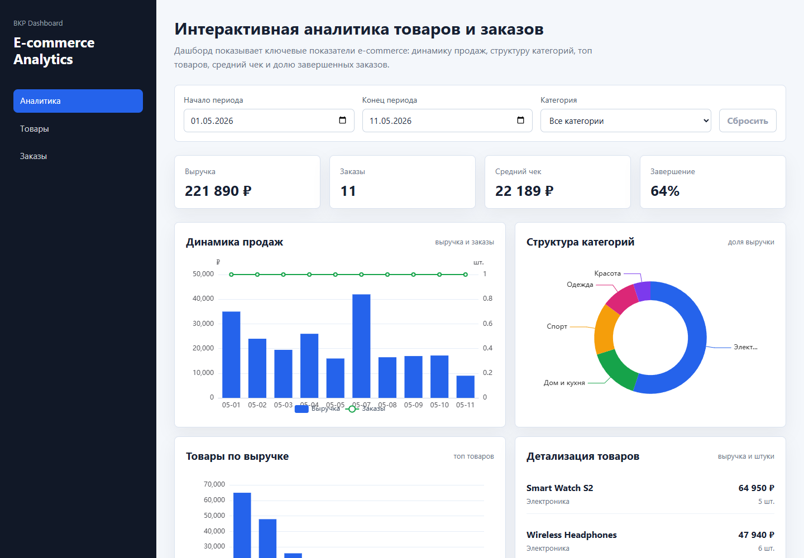
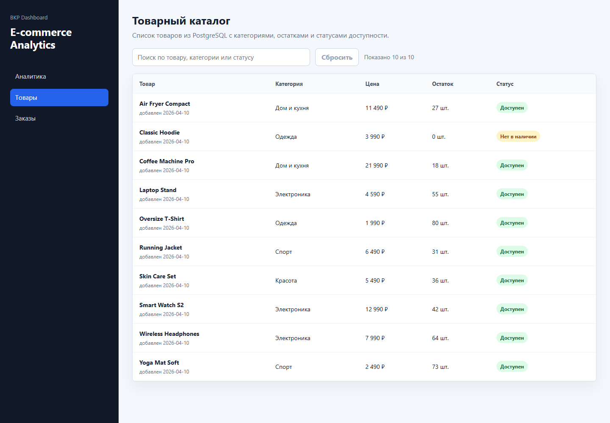
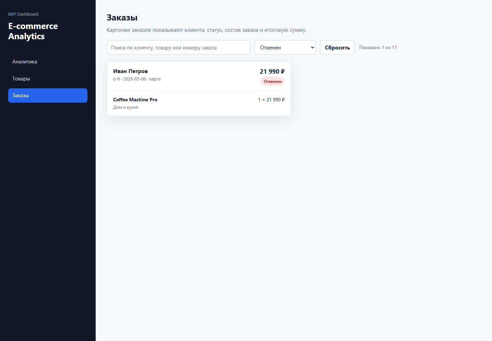

# ecommerce-data-visualization-system

Система интерактивной визуализации данных о товарах и заказах в e-commerce.

[](https://vercel.com/new/clone?repository-url=https://github.com/StepanDrogin/ecommerce-data-visualization-system)

> Основной бесплатный вариант публикации без привязки карты: Vercel + внешний PostgreSQL. Render Blueprint оставлен как альтернативный вариант, но managed PostgreSQL/Redis в Render может потребовать billing-профиль.

## Демо

Production-демо доступно на Vercel:

<https://ecommerce-data-visualization-system-six.vercel.app>

Проверочные API endpoints:

```text
https://ecommerce-data-visualization-system-six.vercel.app/api/health
https://ecommerce-data-visualization-system-six.vercel.app/api/products
https://ecommerce-data-visualization-system-six.vercel.app/api/analytics/dashboard?dateFrom=2026-05-01&dateTo=2026-05-11
```

## Скриншоты

### Аналитика



### Товары



### Заказы



## Назначение проекта

Проект разрабатывается в рамках магистерской ВКР на тему:

> Исследование и разработка системы интерактивной визуализации данных о товарах и заказах в e-commerce.

Цель системы - предоставить web-интерфейс для анализа товарных и заказных данных электронной коммерции с помощью интерактивных графиков, агрегированных показателей и REST API.

## Технологический стек

- Frontend: React, TypeScript, Vite, CSS Modules
- Визуализация данных: Apache ECharts
- Backend: NestJS, TypeScript, REST API
- База данных: PostgreSQL
- ORM: Prisma
- Кэширование: Redis / Redis-compatible Key Value
- Инфраструктура: Docker Compose, Render Blueprint
- Production-деплой: Vercel, внешний PostgreSQL, опциональный Redis
- Управление пакетами: npm workspaces

## Архитектура

```text
Client -> API -> Backend -> PostgreSQL
                       -> Redis
```

Репозиторий организован как monorepo:

```text
apps/
  frontend/   React-приложение аналитического dashboard
  backend/    NestJS API для товаров, заказов и аналитики
packages/
  shared/     Общие TypeScript-типы для frontend и backend
docker/       Материалы по локальной инфраструктуре
docs/         Документация по архитектуре и деплою
```

Основные доменные области:

- `products` - товары, категории и показатели товарного каталога
- `orders` - заказы и связанные позиции
- `analytics` - агрегированные данные для визуализации

## REST API

```text
GET /
GET /health
GET /products
GET /products/categories
GET /orders
GET /analytics/dashboard
GET /analytics/summary
GET /analytics/sales
GET /analytics/products
GET /analytics/categories
```

Аналитические endpoints поддерживают query-параметры:

```text
dateFrom=2026-05-01
dateTo=2026-05-07
categoryId=electronics
```

## Локальный запуск

### 1. Установка зависимостей

```bash
npm install
```

### 2. Переменные окружения

```bash
cp .env.example .env
```

### 3. Инфраструктура

```bash
docker compose up -d postgres redis
```

Для Windows нужен установленный и запущенный Docker Desktop с WSL 2 backend.

### 4. Миграции и демонстрационные данные

```bash
npm run prisma:dev:migrate
npm run prisma:seed
```

### 5. Backend

```bash
npm run dev:backend
```

Backend доступен на `http://localhost:3000`.

### 6. Frontend

```bash
npm run dev:frontend
```

Frontend доступен на `http://localhost:5173`.

## Production-сборка

```bash
npm run build
npm run start:backend
npm run preview:frontend
```

## Деплой

Проект подготовлен к деплою на Render:

- `render.yaml` создает frontend, backend, PostgreSQL и Redis-compatible Key Value.
- `.env.production.example` показывает production-переменные.
- `docs/deployment.md` описывает деплой и подключение домена.

Базовые URL после деплоя:

```text
https://edvs-frontend.onrender.com
https://edvs-backend.onrender.com/health
```

Для собственного домена рекомендуется схема:

```text
app.example.com -> frontend
api.example.com -> backend
```

## Скрипты

```bash
npm run build             # сборка всех workspace-пакетов
npm run dev:frontend      # запуск frontend в dev-режиме
npm run dev:backend       # запуск backend в dev-режиме
npm run start:backend     # запуск собранного backend
npm run preview:frontend  # preview собранного frontend
npm run prisma:generate   # генерация Prisma Client
npm run prisma:dev:migrate # локальное создание/применение миграций
npm run prisma:migrate    # применение production-миграций
npm run prisma:seed       # заполнение демонстрационными данными
```

Повторный seed не очищает базу, если в ней уже есть заказы. Для принудительного пересоздания demo-данных:

```bash
FORCE_SEED=true npm run prisma:seed
```

## Связь с ВКР

Проект демонстрирует практическую часть исследования: разработку web-системы, которая объединяет обработку данных о товарах и заказах, серверную агрегацию и интерактивную визуализацию. Архитектура разделяет пользовательский интерфейс, REST API, слой данных и общие типы, что позволяет использовать проект как прикладной результат ВКР и основу для дальнейшего развития.
